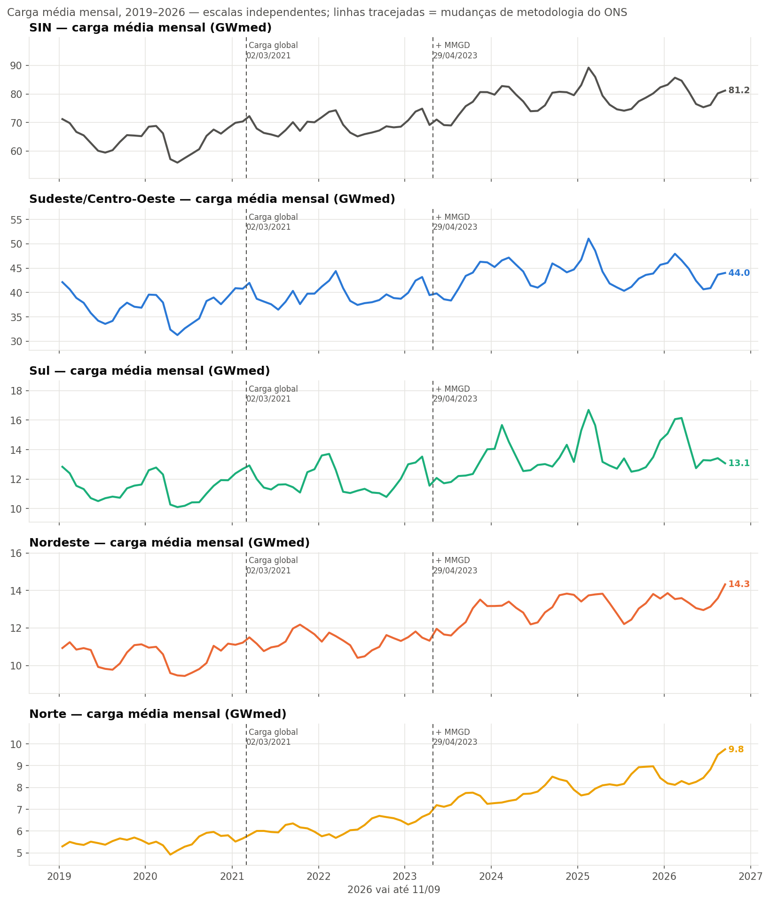
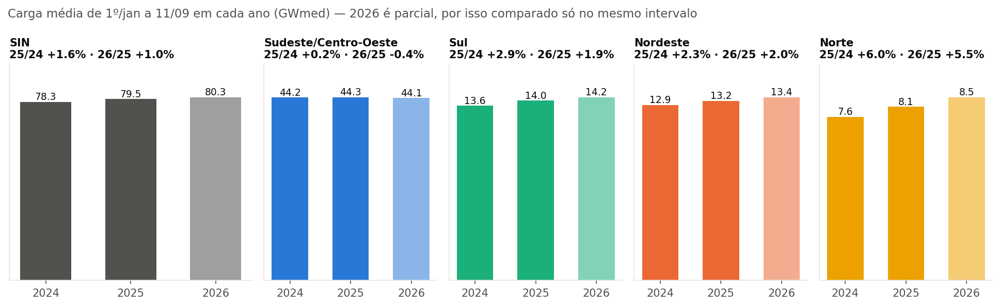
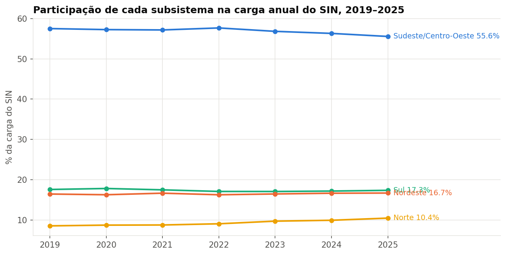
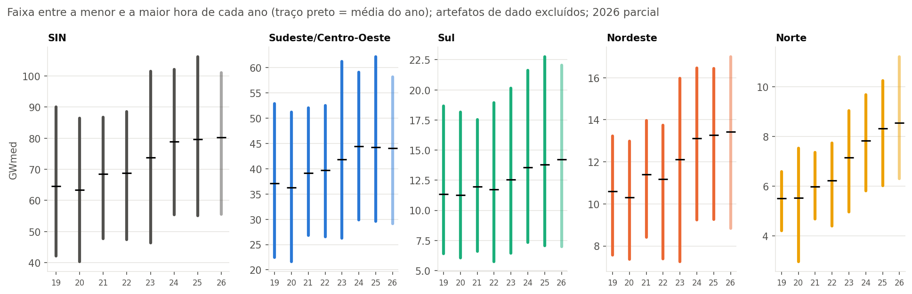

# Bloco 2 — Nível

> Gerado por `src/eda/bloco02_nivel.py` sobre a extração de 11/09/2026. Tabelas e gráficos são reproduzíveis; a interpretação ao final é do analista e está datada.

Pergunta do bloco: **quanto** o sistema demanda, como isso evoluiu e onde a carga está concentrada. Unidade: GWmed (média de potência). Artefatos de dado (`data/reference/anomalias.csv`, tratamento `excluir`) ficam fora dos extremos; nas médias, seu efeito é desprezível.

## 1. Evolução mensal

## 2. Média anual (anos completos)

| Ano | SIN | Sudeste/Centro-Oeste | Sul | Nordeste | Norte | Regime |
|---|---|---|---|---|---|---|
| 2019 | 64.58 | 37.14 | 11.34 | 10.60 | 5.50 | Supervisão ONS |
| 2020 | 63.41 | 36.31 | 11.29 | 10.30 | 5.52 | Supervisão ONS |
| 2021 | 68.53 | 39.18 | 11.97 | 11.40 | 5.99 | misto |
| 2022 | 68.80 | 39.67 | 11.74 | 11.17 | 6.21 | Carga global |
| 2023 | 73.70 | 41.88 | 12.57 | 12.12 | 7.14 | misto |
| 2024 | 78.94 | 44.46 | 13.55 | 13.12 | 7.82 | Carga global + MMGD |
| 2025 | 79.61 | 44.23 | 13.80 | 13.27 | 8.31 | Carga global + MMGD |

Variação ano a ano:

| Variação | SIN | Sudeste/Centro-Oeste | Sul | Nordeste | Norte |
|---|---|---|---|---|---|
| 2020/2019 | -1.8% | -2.3% | -0.4% | -2.9% | +0.3% |
| 2021/2020 | +8.1% | +7.9% | +6.0% | +10.7% | +8.5% |
| 2022/2021 | +0.4% | +1.3% | -1.9% | -2.0% | +3.8% |
| 2023/2022 | +7.1% | +5.6% | +7.1% | +8.5% | +14.9% |
| 2024/2023 | +7.1% | +6.1% | +7.8% | +8.3% | +9.5% |
| 2025/2024 | +0.8% | -0.5% | +1.9% | +1.1% | +6.3% |
| **2025/2019 (atravessa 2 marcos)** | **+23.3%** | **+19.1%** | **+21.8%** | **+25.1%** | **+51.1%** |

## 3. Comparação de períodos equivalentes (YTD)

O último dia disponível de 2026 é 11/09. A tabela compara 1º/jan–11/09 nos três anos do regime atual.

| 1º/jan–11/09 | SIN | Sudeste/Centro-Oeste | Sul | Nordeste | Norte |
|---|---|---|---|---|---|
| 2024 | 78.28 | 44.21 | 13.58 | 12.87 | 7.63 |
| 2025 | 79.50 | 44.29 | 13.96 | 13.17 | 8.09 |
| 2026 | 80.30 | 44.11 | 14.23 | 13.43 | 8.54 |
| 2025/2024 | +1.6% | +0.2% | +2.9% | +2.3% | +6.0% |
| 2026/2025 | +1.0% | -0.4% | +1.9% | +2.0% | +5.5% |

## 4. Onde a carga está concentrada

| Ano | Sudeste/Centro-Oeste | Sul | Nordeste | Norte |
|---|---|---|---|---|
| 2019 | 57.5% | 17.6% | 16.4% | 8.5% |
| 2020 | 57.3% | 17.8% | 16.2% | 8.7% |
| 2021 | 57.2% | 17.5% | 16.6% | 8.7% |
| 2022 | 57.7% | 17.1% | 16.2% | 9.0% |
| 2023 | 56.8% | 17.1% | 16.4% | 9.7% |
| 2024 | 56.3% | 17.2% | 16.6% | 9.9% |
| 2025 | 55.6% | 17.3% | 16.7% | 10.4% |

## 5. Extremos

| Subsistema | Maior hora da série | Quando | Menor hora da série | Quando | Razão máx/mín |
|---|---|---|---|---|---|
| SIN | 106.15 GW | 26/02/2025 14h | 40.36 GW | 10/05/2020 07h | 2.63× |
| Sudeste/Centro-Oeste | 62.15 GW | 18/02/2025 14h | 21.66 GW | 10/05/2020 07h | 2.87× |
| Sul | 22.74 GW | 11/02/2025 14h | 5.76 GW | 08/05/2022 13h | 3.95× |
| Nordeste | 16.99 GW | 04/02/2026 22h | 7.26 GW | 07/04/2023 10h | 2.34× |
| Norte | 11.20 GW | 03/09/2026 14h | 2.97 GW | 19/04/2020 10h | 3.77× |

## 6. Meses de maior e menor carga (média 2024–2025)

| Subsistema | Mês de maior carga | Mês de menor carga | Diferença |
|---|---|---|---|
| SIN | 02 (86.0 GW) | 07 (74.1 GW) | +16.0% |
| Sudeste/Centro-Oeste | 02 (48.8 GW) | 07 (40.7 GW) | +20.0% |
| Sul | 02 (16.2 GW) | 06 (12.7 GW) | +27.9% |
| Nordeste | 11 (13.8 GW) | 07 (12.3 GW) | +12.8% |
| Norte | 09 (8.7 GW) | 01 (7.5 GW) | +16.8% |

## 7. Leitura (analista, 13/09/2026)

**Quanto.** No regime atual, o SIN demanda cerca de **80 GWmed** em média — 44 no Sudeste/Centro-Oeste, 14 no Sul, 13 no Nordeste e 8 no Norte. O pico horário absoluto foi de 106 GW em 26/02/2025, numa onda de calor; a menor hora foi de 40 GW, num domingo de maio de 2020, em plena pandemia. O sistema opera, portanto, numa faixa de **2,6×** entre a hora mais leve e a mais pesada da série.

**Como evoluiu — a leitura ingênua e a correta.** A carga registrada do SIN subiu **+23% entre 2019 e 2025**. Mas os três maiores saltos anuais coincidem com o que não é demanda: 2021 (+8%) mistura recuperação pós-COVID com a entrada da "carga global"; 2023 (+7%) e 2024 (+7%) são a entrada da MMGD estimada em abril/2023 e seu primeiro ano cheio. Quando se compara **sob a mesma metodologia** — 2025 contra 2024, e o YTD de 2026 contra o de 2025 — o SIN cresce **+0,8% e +1,0%**. A história defensável não é "a demanda explodiu"; é "a carga *registrada* saltou por mudanças de medição, e a demanda sob regime homogêneo cresce devagar".

**Onde — e quem cresce.** O Sudeste/Centro-Oeste concentra 56% da carga, mas perde participação todo ano (57,5% → 55,6%). No regime atual ele está **estável ou em leve queda** (−0,5% em 2025; −0,4% no YTD 2026). Quem cresce é o **Norte**: +6% ao ano em 2025 e 2026, passando de 8,5% para 10,4% do SIN — o único subsistema cujo crescimento se mantém forte *dentro* do regime homogêneo. Nordeste e Sul crescem +2 a +3% ao ano. Hipótese para o bloco 10: o que está por trás do Norte (carga industrial no Pará, expansão em Manaus, interligações novas) e se a estabilidade do SE reflete MMGD *dentro* da estimativa do ONS ou saturação real.

**Sazonalidade em primeira leitura.** Os subsistemas têm calendários diferentes: SE e S atingem o máximo em **fevereiro** e o mínimo em **junho/julho** (verão = ar-condicionado); o NE tem máximo em **novembro** e mínimo em julho; o N tem máximo em **setembro** (estação seca e quente) e mínimo em **janeiro** (chuvas). A amplitude sazonal vai de **13% no NE a 28% no S** — o Sul é o subsistema mais sensível ao clima, o que os extremos confirmam: sua razão máx/mín é 3,95×, contra 2,34× no NE. O bloco 3 aprofunda.

**Os picos crescem mais que a base.** No gráfico de extremos, o mínimo anual de cada subsistema é quase estável (S: 6–7 GW todos os anos), enquanto o máximo sobe (S: 18,7 → 22,7 GW). A faixa se alarga por cima — consistente com demanda de climatização em dias quentes, e relevante para o bloco 6 (amplitude).

**Ressalva.** O mínimo do Norte (2,97 GW, 19/04/2020) cai no mês sinalizado como não explicado (A2); não foi excluído porque o tratamento é `sinalizar`, mas não deve ser citado como "menor demanda real" sem essa nota.

**O que leva para o produto.** (1) A tabela YTD e a variação sob regime homogêneo são o KPI de nível correto — não a variação 2019→2025. (2) O gráfico de participação conta a história "o Norte cresce, o SE perde peso". (3) Os marcos metodológicos precisam estar em qualquer série histórica de nível.
