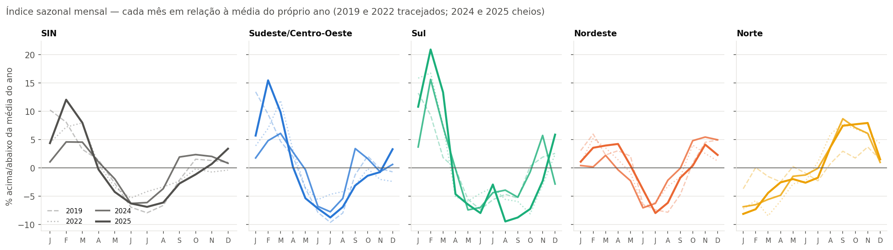
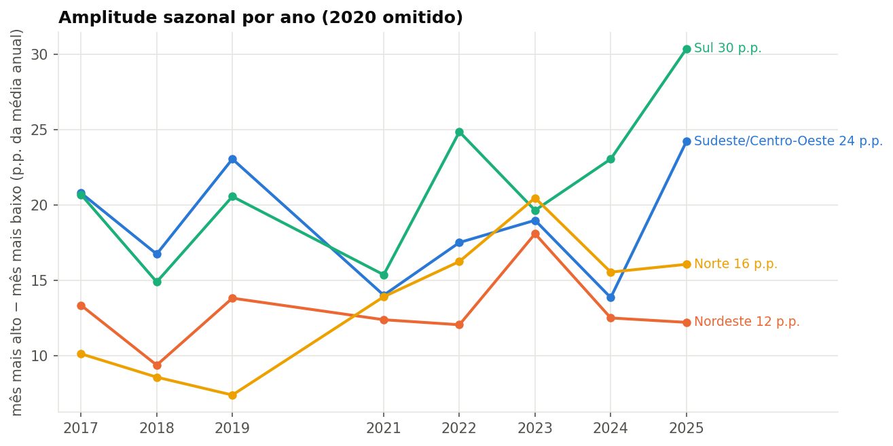
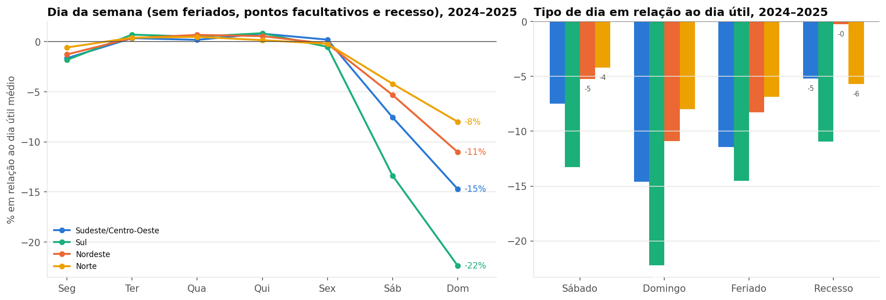
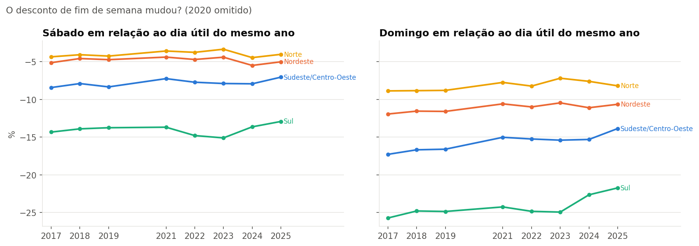

# Bloco 3 — Sazonalidade

> Gerado por `src/eda/bloco03_sazonalidade.py` sobre a extração de 11/09/2026. Tabelas e gráficos são reproduzíveis; a interpretação ao final é do analista e está datada.

Pergunta do bloco: quais padrões se **repetem** — ao longo do ano e ao longo da semana — e se eles são os mesmos em cada subsistema. Todos os índices são relativos (mês ÷ média do ano; tipo de dia ÷ dia útil), o que os torna comparáveis entre subsistemas de tamanhos diferentes e entre regimes metodológicos. 2020 fica fora (D04); dias com horas excluídas em `anomalias.csv` ficam fora; dias úteis do recesso de fim de ano (24/12–02/01) são um tipo de dia à parte.

## 1. Ao longo do ano

Índice médio de 2024–2025 (cada mês em relação à média do ano):

| Mês | SIN | Sudeste/Centro-Oeste | Sul | Nordeste | Norte |
|---|---|---|---|---|---|
| Jan | +2.7% | +3.7% | +7.3% | +0.8% | -7.5% |
| Fev | +8.3% | +10.1% | +18.3% | +1.9% | -6.9% |
| Mar | +6.3% | +8.0% | +10.3% | +3.1% | -5.0% |
| Abr | +0.4% | +1.5% | -2.4% | +2.0% | -3.7% |
| Mai | -3.1% | -2.8% | -6.9% | -0.9% | -1.7% |
| Jun | -6.3% | -7.0% | -7.5% | -5.4% | -1.9% |
| Jul | -6.5% | -8.2% | -3.6% | -7.1% | -0.9% |
| Ago | -4.9% | -6.1% | -6.7% | -4.2% | +3.7% |
| Set | -0.4% | +0.2% | -7.0% | -0.9% | +8.1% |
| Out | +0.6% | +0.1% | -4.0% | +2.6% | +7.4% |
| Nov | +1.4% | -0.7% | +1.7% | +4.8% | +7.0% |
| Dez | +2.1% | +2.0% | +1.5% | +3.6% | +1.3% |

### A sazonalidade está mudando de intensidade?

| Ano | SIN | Sudeste/Centro-Oeste | Sul | Nordeste | Norte |
|---|---|---|---|---|---|
| 2017 | 16.8 | 20.8 | 20.7 | 13.3 | 10.1 |
| 2018 | 13.4 | 16.7 | 14.9 | 9.4 | 8.6 |
| 2019 | 18.2 | 23.1 | 20.6 | 13.8 | 7.4 |
| 2021 | 10.4 | 14.0 | 15.4 | 12.4 | 13.9 |
| 2022 | 13.3 | 17.5 | 24.9 | 12.0 | 16.3 |
| 2023 | 15.9 | 19.0 | 19.7 | 18.1 | 20.5 |
| 2024 | 10.9 | 13.9 | 23.1 | 12.5 | 15.5 |
| 2025 | 18.9 | 24.2 | 30.4 | 12.2 | 16.1 |

## 2. Ao longo da semana

| Dia da semana (2024–2025) | SIN | Sudeste/Centro-Oeste | Sul | Nordeste | Norte |
|---|---|---|---|---|---|
| Seg | -1.5% | -1.7% | -1.8% | -1.3% | -0.6% |
| Ter | +0.4% | +0.3% | +0.7% | +0.4% | +0.4% |
| Qua | +0.4% | +0.2% | +0.5% | +0.7% | +0.5% |
| Qui | +0.6% | +0.8% | +0.8% | +0.5% | +0.1% |
| Sex | -0.0% | +0.2% | -0.5% | -0.2% | -0.2% |
| Sáb | -7.9% | -7.6% | -13.4% | -5.3% | -4.2% |
| Dom | -14.8% | -14.7% | -22.4% | -11.0% | -8.0% |

| Tipo de dia (2024–2025) | Dias | SIN | Sudeste/Centro-Oeste | Sul | Nordeste | Norte |
|---|---|---|---|---|---|---|
| Dia útil | 491 | +0.0% | +0.0% | +0.0% | +0.0% | +0.0% |
| Sábado | 100 | -7.8% | -7.5% | -13.3% | -5.2% | -4.2% |
| Domingo | 100 | -14.7% | -14.6% | -22.2% | -10.9% | -8.0% |
| Feriado | 26 | -11.0% | -11.4% | -14.5% | -8.3% | -6.9% |
| Recesso | 12 | -5.4% | -5.2% | -10.9% | -0.2% | -5.7% |

### O desconto de fim de semana mudou ao longo dos anos?

| Domingo ÷ dia útil | SIN | Sudeste/Centro-Oeste | Sul | Nordeste | Norte |
|---|---|---|---|---|---|
| 2017 | -17.2% | -17.3% | -25.7% | -11.9% | -8.9% |
| 2018 | -16.7% | -16.7% | -24.8% | -11.6% | -8.8% |
| 2019 | -16.6% | -16.6% | -24.9% | -11.6% | -8.8% |
| 2021 | -15.3% | -15.0% | -24.3% | -10.6% | -7.8% |
| 2022 | -15.6% | -15.3% | -24.8% | -11.0% | -8.2% |
| 2023 | -15.5% | -15.4% | -24.9% | -10.5% | -7.2% |
| 2024 | -15.1% | -15.3% | -22.7% | -11.1% | -7.6% |
| 2025 | -14.1% | -13.9% | -21.7% | -10.7% | -8.2% |

### Fim de semana × estação

| Domingo ÷ dia útil, por estação (2024–2025) | SIN | Sudeste/Centro-Oeste | Sul | Nordeste | Norte |
|---|---|---|---|---|---|
| Verão | -14.4% | -14.6% | -20.8% | -9.9% | -7.0% |
| Outono | -15.0% | -14.8% | -23.6% | -11.0% | -8.1% |
| Inverno | -15.0% | -14.8% | -23.8% | -10.7% | -8.0% |
| Primavera | -15.0% | -15.2% | -22.2% | -11.8% | -7.1% |

## 3. Leitura (analista, 13/09/2026; revisada após a ampliação para 2017)

**Quatro calendários, não um.** "O verão pesa mais" vale para o Sudeste/Centro-Oeste (fevereiro +10%, julho −8%) e sobretudo para o Sul (fevereiro **+18%**, junho −7%, setembro −7%). O Nordeste tem um ciclo suave (novembro +5%, julho −7%), com máximo na primavera. O Norte é o inverso do resto do país: máximo em **setembro–outubro (+8%)**, fim da estação seca, e mínimo em **janeiro–fevereiro (−7%)**, na estação chuvosa — exatamente quando SE e S estão no pico. O SIN (fevereiro +8%, julho −6%) é dominado pelo SE e esconde o Norte. É o argumento mais direto para o produto mostrar subsistemas em vez de só o Brasil.

**A intensidade da sazonalidade varia com o verão, e o Norte ficou mais sazonal.** No SE e no S não há tendência limpa: a amplitude entre o mês mais alto e o mais baixo foi de 23 p.p. em 2019, 14 em 2024 e 24 em 2025 no SE — o que muda é quão quente foi o verão (2025 teve a onda de calor dos recordes; 2024 não). No Sul, 2025 foi o ano mais sazonal da série (30 p.p.). O Nordeste é o mais estável (12–14 p.p., exceto 2023). O achado inesperado é o **Norte**: sua amplitude sazonal era de 7–10 p.p. em 2017–2019 e passou a 15–20 p.p. desde 2022. Um subsistema que era quase plano ao longo do ano passou a ter um pico claro em setembro. Hipótese para o bloco 10: crescimento da carga residencial/comercial (climatização) em relação à industrial de base, que não tem estação.

**A semana tem dois formatos — e o Sul tem o fim de semana mais fundo.** De segunda a sexta a carga é plana (segunda −1,5%, o resto ±0,7%). Sábado cai **8%** e domingo **15%** no SIN. Mas a variação entre subsistemas é grande: no **Sul** o domingo cai **22%** e o sábado 13%; no **Norte**, o domingo cai só **8%** e o sábado 4%. Leitura: o Norte tem uma base industrial (eletrointensivos) que não para no fim de semana; o Sul tem carga comercial e industrial que para. Feriado fica entre sábado e domingo (−11%); os dias úteis do recesso de fim de ano (24/12–02/01) se comportam como sábado, menos no Nordeste.

**O domingo está ficando menos diferente — mas só a partir de 2024.** No SIN o desconto de domingo ficou em −15 a −17% de 2017 a 2023 e caiu para −15% em 2024 e **−14% em 2025**; no SE, de −16,6% para −13,9%; no Sul, de −25% para −21,6%. No NE e no N não mudou. O momento (2024–2025) e a geografia (SE e S, onde há mais MMGD) apontam para a estimativa de MMGD, somada igualmente em qualquer dia, como parte da explicação — a ser separada de crescimento residencial no bloco 8.

**Domingo de verão é menos domingo.** No Sul o desconto de domingo é −20% no verão contra −24% no outono/inverno; no NE, −10% contra −11 a −12%. Climatização residencial funciona no domingo. No SE a diferença é pequena (−14% vs −15%) e no Norte não há.

**O que leva para o produto.** (1) Um pequeno múltiplo do índice mensal por subsistema — o gráfico que diz "o Brasil não tem uma estação de pico, tem quatro". (2) A tabela de tipo de dia justifica, com números, a segmentação das curvas típicas e mostra que o formato da semana também é regional. (3) A tendência do domingo desde 2024 é candidata à Camada 3, condicionada ao bloco 8.
