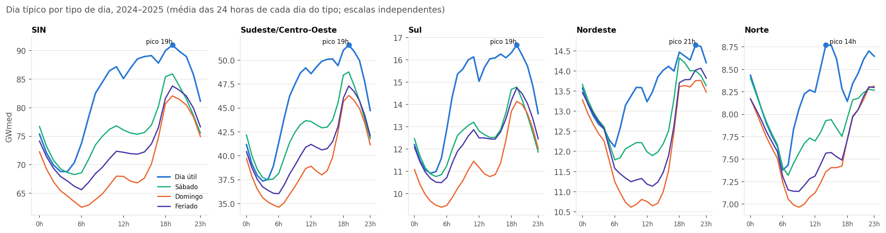
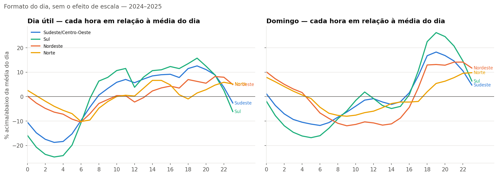
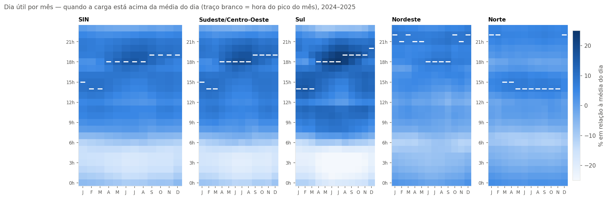
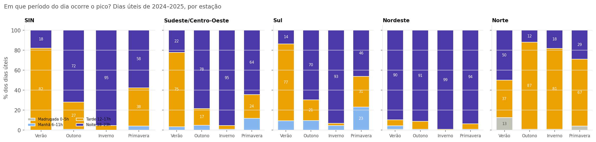

# Bloco 4 — Ciclo intradiário

> Gerado por `src/eda/bloco04_intradiario.py` sobre a extração de 11/09/2026. Tabelas e gráficos são reproduzíveis; a interpretação ao final é do analista e está datada.

Pergunta do bloco: **como a carga se distribui pelas 24 horas** — o "dia típico" de cada subsistema — e como esse formato muda entre tipos de dia e estações. Janela: núcleo comparável 2024–2025. Dias com horas excluídas em `anomalias.csv` (escopo horário) e vésperas de Natal/Ano-Novo ficam fora. "Dia típico" é a média, hora a hora, de todos os dias do tipo; a versão normalizada divide cada dia pela sua própria média antes de tirar a média, para que cada dia pese igual.

## 1. O dia típico por tipo de dia

| Subsistema | Tipo de dia | Dias | Média (GW) | Pico (GW) | Hora | Vale (GW) | Hora | Amplitude ÷ média | Fator de carga |
|---|---|---|---|---|---|---|---|---|---|
| SIN | Dia útil | 499 | 82.1 | 90.9 | 19h | 68.8 | 4h | 27% | 0.90 |
| SIN | Sábado | 100 | 75.8 | 85.9 | 19h | 68.3 | 5h | 23% | 0.88 |
| SIN | Domingo | 100 | 70.1 | 82.1 | 19h | 62.6 | 6h | 28% | 0.85 |
| SIN | Feriado | 26 | 73.2 | 83.8 | 19h | 65.6 | 6h | 25% | 0.87 |
| Sudeste/Centro-Oeste | Dia útil | 501 | 45.9 | 51.6 | 19h | 37.4 | 3h | 31% | 0.89 |
| Sudeste/Centro-Oeste | Sábado | 100 | 42.5 | 48.8 | 19h | 37.5 | 4h | 27% | 0.87 |
| Sudeste/Centro-Oeste | Domingo | 100 | 39.2 | 46.3 | 19h | 34.6 | 6h | 30% | 0.85 |
| Sudeste/Centro-Oeste | Feriado | 26 | 40.7 | 47.3 | 19h | 36.0 | 6h | 28% | 0.86 |
| Sul | Dia útil | 501 | 14.5 | 16.7 | 19h | 10.9 | 3h | 40% | 0.87 |
| Sul | Sábado | 100 | 12.6 | 14.8 | 19h | 10.8 | 4h | 32% | 0.85 |
| Sul | Domingo | 100 | 11.3 | 14.1 | 19h | 9.4 | 5h | 42% | 0.80 |
| Sul | Feriado | 26 | 12.4 | 14.7 | 19h | 10.5 | 5h | 34% | 0.84 |
| Nordeste | Dia útil | 500 | 13.5 | 14.6 | 21h | 12.1 | 6h | 19% | 0.92 |
| Nordeste | Sábado | 100 | 12.8 | 14.3 | 18h | 11.8 | 6h | 20% | 0.90 |
| Nordeste | Domingo | 100 | 12.1 | 13.8 | 22h | 10.6 | 9h | 26% | 0.88 |
| Nordeste | Feriado | 26 | 12.4 | 14.1 | 22h | 11.1 | 13h | 24% | 0.88 |
| Norte | Dia útil | 500 | 8.2 | 8.8 | 14h | 7.4 | 6h | 17% | 0.94 |
| Norte | Sábado | 100 | 7.9 | 8.4 | 0h | 7.3 | 7h | 14% | 0.94 |
| Norte | Domingo | 100 | 7.6 | 8.3 | 23h | 7.0 | 9h | 18% | 0.91 |
| Norte | Feriado | 26 | 7.7 | 8.3 | 22h | 7.1 | 9h | 15% | 0.92 |

## 2. O formato sem a escala

| Dia útil, hora | SIN | Sudeste/Centro-Oeste | Sul | Nordeste | Norte |
|---|---|---|---|---|---|
| 3h | -16% | -19% | -25% | -6% | -4% |
| 6h | -10% | -10% | -11% | -10% | -10% |
| 9h | +3% | +3% | +8% | -1% | -2% |
| 12h | +4% | +6% | +4% | -2% | +0% |
| 15h | +8% | +9% | +11% | +4% | +7% |
| 18h | +10% | +11% | +13% | +7% | -1% |
| 19h | +11% | +13% | +16% | +6% | +1% |
| 21h | +8% | +9% | +9% | +8% | +5% |
| 23h | -1% | -3% | -6% | +5% | +5% |

## 3. O dia típico muda com a estação?

| Subsistema | Estação (dia útil) | Hora do pico | Hora do vale | Amplitude ÷ média | Fator de carga | Pico à tarde | Pico à noite |
|---|---|---|---|---|---|---|---|
| SIN | Verão | 14h | 4h | 25% | 0.91 | 82% | 18% |
| SIN | Outono | 18h | 3h | 29% | 0.89 | 27% | 72% |
| SIN | Inverno | 18h | 3h | 32% | 0.87 | 5% | 95% |
| SIN | Primavera | 19h | 4h | 27% | 0.90 | 38% | 58% |
| Sudeste/Centro-Oeste | Verão | 14h | 4h | 27% | 0.90 | 75% | 22% |
| Sudeste/Centro-Oeste | Outono | 18h | 3h | 33% | 0.88 | 17% | 78% |
| Sudeste/Centro-Oeste | Inverno | 18h | 3h | 37% | 0.85 | 4% | 95% |
| Sudeste/Centro-Oeste | Primavera | 19h | 3h | 31% | 0.89 | 24% | 64% |
| Sul | Verão | 14h | 4h | 37% | 0.87 | 77% | 14% |
| Sul | Outono | 18h | 3h | 43% | 0.85 | 21% | 70% |
| Sul | Inverno | 19h | 3h | 50% | 0.82 | 2% | 93% |
| Sul | Primavera | 19h | 3h | 40% | 0.87 | 31% | 46% |
| Nordeste | Verão | 22h | 6h | 20% | 0.92 | 6% | 90% |
| Nordeste | Outono | 21h | 6h | 18% | 0.93 | 8% | 91% |
| Nordeste | Inverno | 18h | 6h | 18% | 0.91 | 1% | 99% |
| Nordeste | Primavera | 22h | 6h | 20% | 0.92 | 6% | 94% |
| Norte | Verão | 22h | 7h | 15% | 0.94 | 37% | 50% |
| Norte | Outono | 15h | 6h | 18% | 0.93 | 87% | 12% |
| Norte | Inverno | 14h | 6h | 18% | 0.93 | 81% | 18% |
| Norte | Primavera | 14h | 6h | 18% | 0.94 | 67% | 29% |

## 4. Leitura (analista, 13/09/2026)

**O dia típico do Brasil.** Num dia útil de 2024–2025 o SIN acorda no vale das **4h** (−16% da média), sobe até as 9h, fica num patamar alto a tarde inteira (+8% às 15h) e atinge o pico às **19h** (+11%), quando ainda há carga comercial e a residencial já entrou. A amplitude entre vale e pico é 27% da média; o fator de carga, 0,90 — a hora mais pesada é só 10% acima da média, o que diz que o sistema é relativamente "plano". Sábado e domingo mantêm o pico às 19h, mas perdem a manhã: o vale desliza para 5–6h e a subida matinal some.

**Existem dois formatos de dia no país, não um.** Sudeste/Centro-Oeste e Sul têm o dia "clássico": vale profundo na madrugada (−19% e **−25%** às 3h), rampa da manhã, tarde alta, pico às 19h (+13% e +16%). Nordeste e Norte são quase planos: madrugada só −4 a −6%, mínimo às 6h, amplitude de 17–19% contra 31–40%. E o pico está em outro lugar: no **Nordeste às 21–22h**, tarde da noite; no **Norte às 14h**, com a noite abaixo da média. Fator de carga de 0,92 e 0,94 — o Norte é o subsistema mais plano do Brasil, consistente com a base industrial contínua identificada nos blocos anteriores. Somar tudo no SIN produz o formato do SE, porque o SE é 56% do total.

**O pico muda de lugar com a estação — e isso é a chave do produto.** No verão, o pico do SIN é às **14h** em 82% dos dias úteis; no inverno, é às **18–19h** em 95% deles. No SE e no Sul a explicação é o ar-condicionado: no verão ele enche a tarde e o dia fica *mais plano* (amplitude 27% no SE, 37% no Sul); no inverno, sem climatização diurna, a tarde cai e a noite (iluminação, chuveiro, aquecimento) vira o pico isolado — amplitude 37% no SE e **50% no Sul**, a maior do país. Ou seja: o inverno tem menos carga, mas um dia mais "pontudo". O heatmap mostra isso como duas manchas: uma às 14–15h de novembro a março, outra às 18–19h de abril a setembro. No **Nordeste** o pico é noturno em todas as estações (90–99% dos dias), só desliza de 18h no inverno para 22h no verão. No **Norte** o pico é à tarde (14–15h) em outono, inverno e primavera, mas no verão — a estação chuvosa — migra para as 22h, quando o calor diurno alivia.

**O que isso muda nas perguntas do projeto.** A pergunta "em que horário ocorre o pico?" não tem uma resposta; tem uma por subsistema e por estação. Uma média anual da hora do pico (o que um dashboard ingênuo mostraria) misturaria 14h e 19h e produziria um número que não acontece em nenhum dia. O bloco 8 vai perguntar se essa alternância verão/inverno é nova (efeito do ar-condicionado e da MMGD) ou se 2019 já era assim.

**O que leva para o produto.** (1) O gráfico de formato normalizado com os quatro subsistemas sobrepostos é a **assinatura visual** da "anatomia": mostra em uma imagem que o país tem dois formatos de dia. (2) O heatmap hora × mês é o segundo candidato — resolve "quando é o pico?" sem forçar uma resposta única. (3) A tabela de tipo de dia sustenta as medidas de pico, vale, amplitude e fator de carga com definições explícitas.
