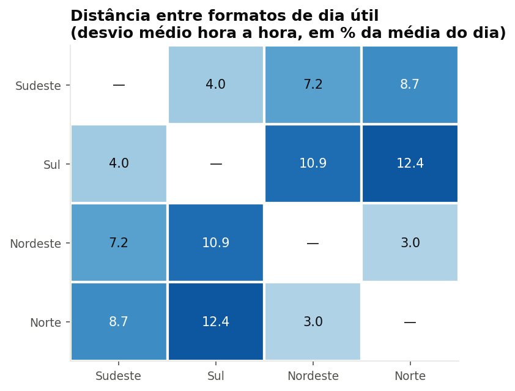
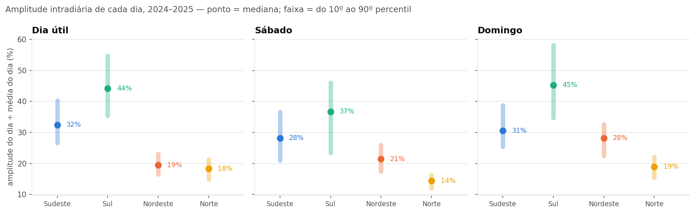
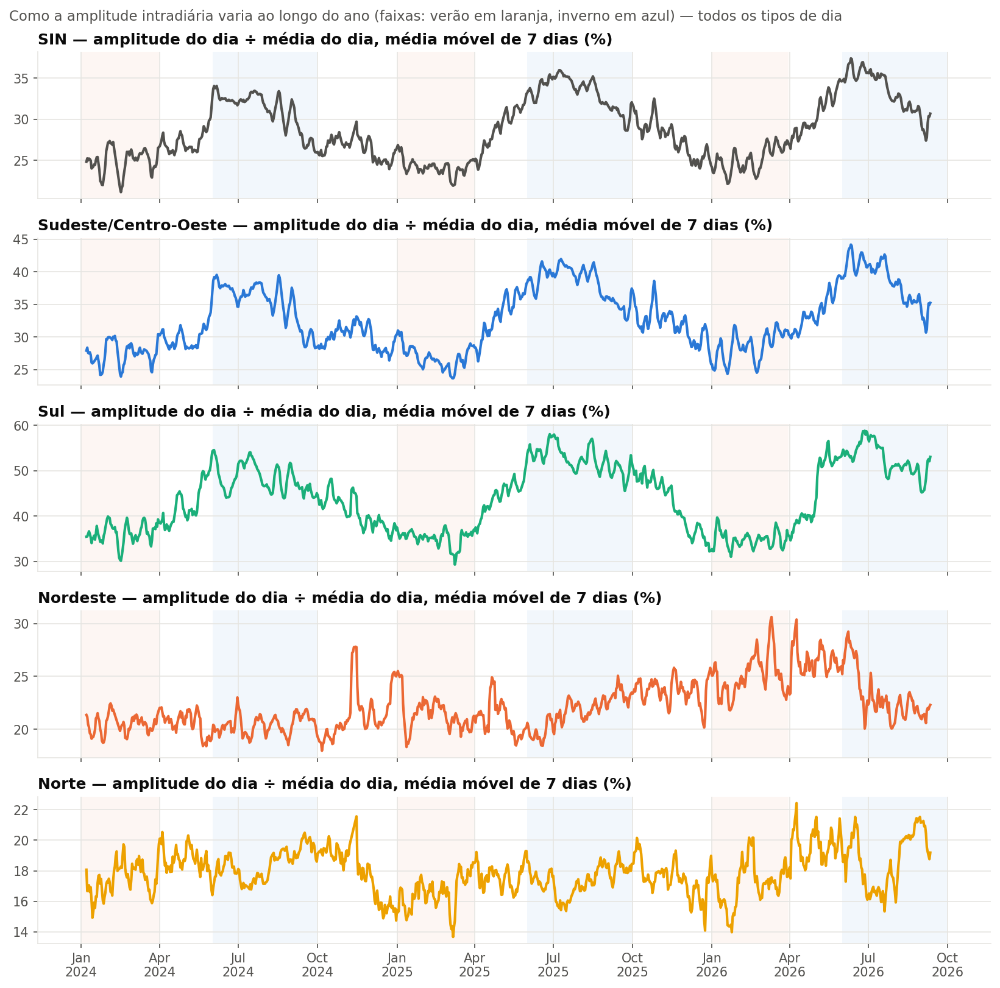
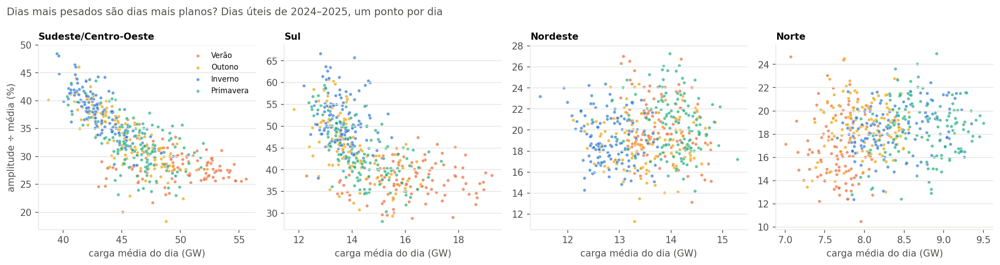

# Blocos 5 e 6 — Diferenças entre subsistemas; pico, vale e amplitude

> Gerado por `src/eda/bloco05_06_subsistemas_amplitude.py` sobre a extração de 11/09/2026. Tabelas e gráficos são reproduzíveis; a interpretação ao final é do analista e está datada.

Perguntas: os subsistemas diferem só em **escala** ou também em **formato**? Quais têm maior amplitude intradiária? Como pico, vale e amplitude se comportam dia a dia? Definições em [03-metodologia.md](../03-metodologia.md) §5: amplitude relativa = (pico − vale) ÷ média do dia; fator de carga = média ÷ pico. Janela: 2024–2025 para distribuições; 2024–2026 para séries. Exclusões como no bloco 4.

## Bloco 5 — Escala ou formato?

Desvio médio hora a hora entre as curvas típicas normalizadas de dia útil (em pontos percentuais da média do dia):

|  | Sudeste | Sul | Nordeste | Norte |
|---|---|---|---|---|
| Sudeste | — | 4.0 | 7.2 | 8.7 |
| Sul | 4.0 | — | 10.9 | 12.4 |
| Nordeste | 7.2 | 10.9 | — | 3.0 |
| Norte | 8.7 | 12.4 | 3.0 | — |

Cada subsistema em relação ao SIN:

| Subsistema | Escala (÷ SIN) | Distância de formato para o SIN | Hora do pico (dia útil) | Amplitude ÷ média |
|---|---|---|---|---|
| Sudeste/Centro-Oeste | 56% | 1.5 | 19h vs 19h | 31% vs 27% |
| Sul | 17% | 5.2 | 19h vs 19h | 41% vs 27% |
| Nordeste | 17% | 5.8 | 21h vs 19h | 19% vs 27% |
| Norte | 10% | 7.3 | 14h vs 19h | 17% vs 27% |

### Quem tem a maior amplitude intradiária?

| Subsistema | Tipo de dia | Amplitude p10 | Mediana | p90 | Fator de carga (mediana) |
|---|---|---|---|---|---|
| SIN | Dia útil | 24% | 29% | 35% | 0.89 |
| SIN | Sábado | 19% | 25% | 31% | 0.87 |
| SIN | Domingo | 24% | 29% | 35% | 0.85 |
| Sudeste/Centro-Oeste | Dia útil | 27% | 32% | 40% | 0.88 |
| Sudeste/Centro-Oeste | Sábado | 21% | 28% | 37% | 0.86 |
| Sudeste/Centro-Oeste | Domingo | 25% | 31% | 39% | 0.84 |
| Sul | Dia útil | 35% | 44% | 55% | 0.84 |
| Sul | Sábado | 23% | 37% | 46% | 0.82 |
| Sul | Domingo | 35% | 45% | 58% | 0.78 |
| Nordeste | Dia útil | 17% | 19% | 23% | 0.92 |
| Nordeste | Sábado | 17% | 21% | 26% | 0.89 |
| Nordeste | Domingo | 22% | 28% | 33% | 0.87 |
| Norte | Dia útil | 15% | 18% | 21% | 0.93 |
| Norte | Sábado | 12% | 14% | 16% | 0.94 |
| Norte | Domingo | 15% | 19% | 22% | 0.91 |

## Bloco 6 — Pico, vale e amplitude ao longo do tempo

| Subsistema | Estação (dia útil) | Amplitude mediana | Fator de carga | Hora do pico mais frequente | Pico mediano (GW) | Vale mediano (GW) |
|---|---|---|---|---|---|---|
| SIN | Verão | 25% | 0.91 | 14h (57% dos dias) | 96.8 | 73.9 |
| SIN | Outono | 30% | 0.89 | 18h (66% dos dias) | 90.7 | 66.8 |
| SIN | Inverno | 33% | 0.87 | 18h (68% dos dias) | 89.9 | 63.9 |
| SIN | Primavera | 28% | 0.90 | 19h (54% dos dias) | 92.9 | 70.3 |
| Sudeste/Centro-Oeste | Verão | 28% | 0.90 | 14h (55% dos dias) | 55.2 | 41.4 |
| Sudeste/Centro-Oeste | Outono | 34% | 0.87 | 18h (69% dos dias) | 51.5 | 36.2 |
| Sudeste/Centro-Oeste | Inverno | 38% | 0.85 | 18h (79% dos dias) | 50.6 | 34.2 |
| Sudeste/Centro-Oeste | Primavera | 32% | 0.89 | 19h (62% dos dias) | 52.3 | 37.6 |
| Sul | Verão | 38% | 0.86 | 14h (67% dos dias) | 18.6 | 12.6 |
| Sul | Outono | 45% | 0.84 | 18h (60% dos dias) | 16.6 | 10.2 |
| Sul | Inverno | 50% | 0.81 | 18h (48% dos dias) | 16.8 | 9.9 |
| Sul | Primavera | 42% | 0.85 | 19h (40% dos dias) | 16.9 | 10.8 |
| Nordeste | Verão | 20% | 0.92 | 22h (55% dos dias) | 14.9 | 12.1 |
| Nordeste | Outono | 19% | 0.93 | 21h (46% dos dias) | 14.6 | 12.1 |
| Nordeste | Inverno | 19% | 0.91 | 18h (73% dos dias) | 14.1 | 11.7 |
| Nordeste | Primavera | 21% | 0.92 | 22h (44% dos dias) | 15.4 | 12.5 |
| Norte | Verão | 16% | 0.93 | 22h (38% dos dias) | 8.3 | 7.0 |
| Norte | Outono | 19% | 0.93 | 15h (42% dos dias) | 8.6 | 7.2 |
| Norte | Inverno | 19% | 0.93 | 14h (49% dos dias) | 9.0 | 7.4 |
| Norte | Primavera | 19% | 0.93 | 14h (49% dos dias) | 9.4 | 7.8 |

### Dias mais pesados são dias mais planos?

| Subsistema | Correlação nível × amplitude | Amplitude nos 25 dias mais pesados | Amplitude nos 25 dias mais leves |
|---|---|---|---|
| SIN | -0.72 | 25% | 36% |
| Sudeste/Centro-Oeste | -0.76 | 28% | 42% |
| Sul | -0.61 | 37% | 51% |
| Nordeste | +0.04 | 19% | 20% |
| Norte | +0.20 | 18% | 17% |

## Leitura (analista, 13/09/2026)

**Escala e formato são coisas diferentes — e os subsistemas se agrupam em pares.** A distância entre as curvas típicas normalizadas mostra dois grupos claros: **Sudeste e Sul** (desvio de 3,9 p.p. entre si) e **Nordeste e Norte** (3,0 p.p.). Entre os grupos a distância é de 7 a 12 p.p. — o Sul e o Norte são os dois formatos mais diferentes do país (12,3). O SIN é praticamente o Sudeste (distância 1,5): tudo o que o Brasil agregado "mostra" sobre o formato do dia é o formato do Sudeste, com 56% da escala. Responder "quanto do Nordeste é escala e quanto é formato": ele tem 17% do tamanho do SIN e um formato que difere em 5,8 p.p. hora a hora, com o pico duas horas mais tarde (21h) e amplitude 30% menor (19% contra 27%).

**Quem tem a maior amplitude é o Sul, por larga margem.** A amplitude mediana de um dia útil é **44%** da média no Sul, 32% no SE, 19% no NE e **18%** no Norte. A faixa entre o 10º e o 90º percentil também é maior no Sul (35–55%): o Sul não só tem o dia mais "pontudo", como tem os dias mais variados entre si. O domingo do Sul chega a 45% (fator de carga 0,78) — a rampa noturna de domingo que o diagnóstico de qualidade sinalizava como "anomalia" é a característica mais marcante do subsistema. O Norte é o oposto: sábado com amplitude de 14% e fator de carga 0,94 — um dia quase reto.

**A amplitude tem estação: cresce no inverno em SE e S, não muda em NE e N.** Na série diária (média móvel de 7 dias) o SE oscila entre ~28% no verão e ~38% no inverno; o Sul entre ~38% e ~50%. No Nordeste e no Norte a linha é plana o ano inteiro (19% ± 2). A hora do pico mais frequente confirma o bloco 4 com granularidade diária: no SE, 14h em 52% dos dias de verão e 18h em 79% dos de inverno.

**Dias mais pesados são dias mais planos — o achado central destes blocos.** No SE a correlação entre a carga média do dia e sua amplitude relativa é **−0,75**; no Sul, −0,58; no SIN, −0,71. Os 25 dias úteis mais pesados do SE têm amplitude de 28%; os 25 mais leves, 41%. A leitura: o que faz um dia ser pesado é o ar-condicionado, que liga de manhã e só desliga à noite — ele enche a tarde e o começo da noite, e o dia fica alto e plano. O que faz um dia ser leve é a ausência de climatização — sobra o pico noturno de iluminação e chuveiro sobre uma tarde baixa. No Nordeste (+0,04) e no Norte (+0,21) a relação não existe ou se inverte de leve: a climatização ali é carga de base, presente todo dia, e não diferencia dias.

**Implicação para a leitura do sistema.** "Pico" e "amplitude" contam histórias opostas: os dias de pico recorde (fevereiro/2025) são dias de amplitude *baixa*. Um dashboard que mostrasse só o pico diria "o sistema está mais estressado no verão"; um que mostrasse só a amplitude diria "no inverno". Os dois são verdade, e o produto precisa dizer isso: **o verão estressa o nível; o inverno estressa o formato.**

**O que leva para o produto.** (1) O scatter nível × amplitude, colorido por estação, é o gráfico que resume os blocos 4–6 numa imagem e sustenta a frase acima. (2) A matriz de distância justifica tratar SE/S e NE/N como pares na narrativa. (3) A distribuição de amplitude por subsistema e tipo de dia é a tabela de referência das medidas de formato.
