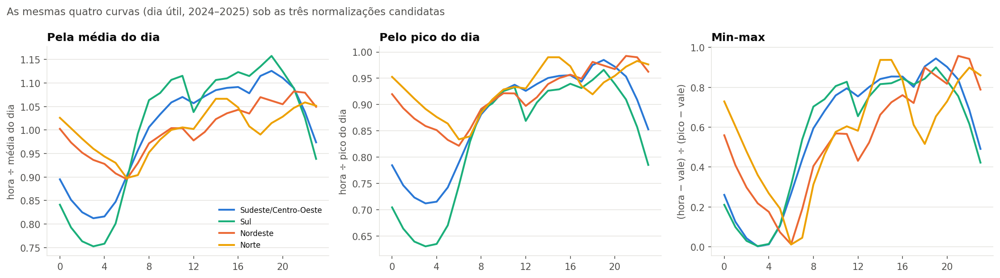
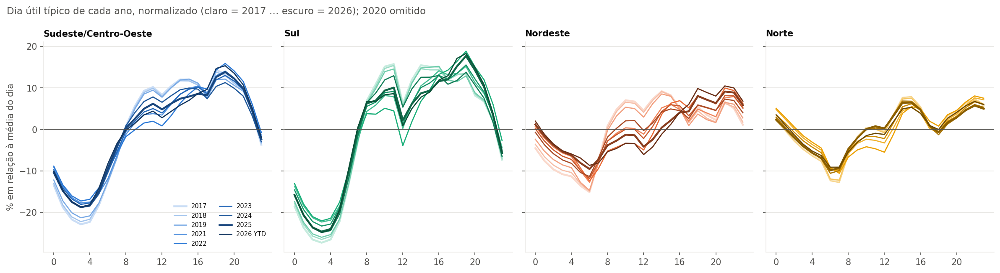
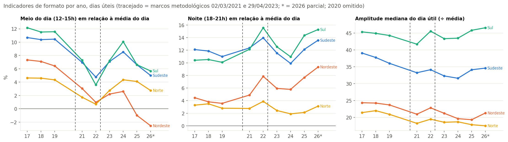
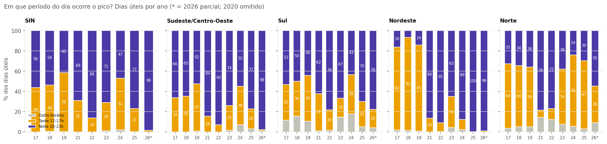
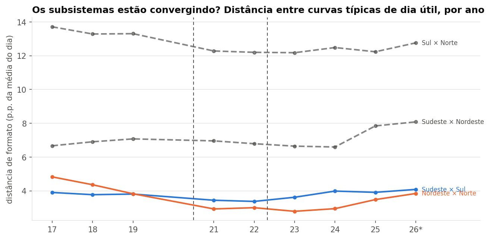

# Blocos 7 e 8 — Curvas normalizadas; mudança histórica

> Gerado por `src/eda/bloco07_08_normalizacao_mudanca.py` sobre a extração de 11/09/2026. Tabelas e gráficos são reproduzíveis; a interpretação ao final é do analista e está datada.

## Bloco 7 — Qual normalização?

As três candidatas de [03-metodologia.md](../03-metodologia.md) §6, aplicadas às mesmas curvas típicas de dia útil (2024–2025):

| Subsistema | Amplitude (÷ média) | Amplitude (÷ pico) | Amplitude (min-max) | Valor às 3h (média / pico / min-max) |
|---|---|---|---|---|
| Sudeste/Centro-Oeste | 0.31 | 0.29 | 0.94 | 0.81 / 0.71 / 0.00 |
| Sul | 0.40 | 0.37 | 0.90 | 0.75 / 0.63 / 0.00 |
| Nordeste | 0.19 | 0.18 | 0.94 | 0.94 / 0.86 / 0.22 |
| Norte | 0.17 | 0.17 | 0.93 | 0.96 / 0.89 / 0.36 |

## Bloco 8 — Como o formato mudou, 2017 → 2026

Dias úteis; 2020 omitido (D04); janelas de horário de verão excluídas (A8, 2017–2019); dias com horas excluídas em `anomalias.csv` fora. Regimes: 2017–2019 = Supervisão ONS; 2021 e 2023 = anos mistos; 2022 = Carga global; 2024–2026 = Carga global + MMGD. **Toda diferença que atravessa 2021 ou 2023 mistura mudança de demanda com mudança de medição.**

| Subsistema | Ano | Regime | Dias | Meio do dia 12–15h | Noite 18–21h | Madrugada 1–4h | Amplitude mediana | Fator de carga | Pico à tarde | Pico à noite |
|---|---|---|---|---|---|---|---|---|---|---|
| SIN | 2017 | Supervisão | 162 | +9.9% | +9.8% | -18.8% | 34% | 0.88 | 44% | 56% |
| SIN | 2018 | Supervisão | 177 | +9.6% | +9.6% | -18.2% | 33% | 0.88 | 46% | 54% |
| SIN | 2019 | Supervisão | 218 | +9.5% | +8.9% | -17.2% | 32% | 0.88 | 58% | 41% |
| SIN | 2021 | misto | 248 | +5.9% | +10.2% | -13.9% | 28% | 0.89 | 31% | 69% |
| SIN | 2022 | Global | 251 | +3.6% | +12.3% | -13.4% | 30% | 0.87 | 14% | 86% |
| SIN | 2023 | misto | 248 | +5.9% | +9.9% | -14.3% | 29% | 0.89 | 28% | 71% |
| SIN | 2024 | Global+MMGD | 249 | +7.4% | +8.6% | -15.2% | 28% | 0.90 | 51% | 47% |
| SIN | 2025 | Global+MMGD | 250 | +5.1% | +10.7% | -14.7% | 29% | 0.88 | 23% | 77% |
| SIN | 2026 | Global+MMGD (YTD) | 174 | +3.7% | +12.0% | -14.5% | 30% | 0.88 | 2% | 98% |
| Sudeste/Centro-Oeste | 2017 | Supervisão | 162 | +10.7% | +12.1% | -21.4% | 39% | 0.86 | 34% | 66% |
| Sudeste/Centro-Oeste | 2018 | Supervisão | 178 | +10.4% | +11.9% | -20.8% | 38% | 0.87 | 35% | 65% |
| Sudeste/Centro-Oeste | 2019 | Supervisão | 218 | +10.5% | +11.0% | -19.8% | 36% | 0.87 | 47% | 52% |
| Sudeste/Centro-Oeste | 2021 | misto | 249 | +7.0% | +12.4% | -16.3% | 33% | 0.87 | 16% | 84% |
| Sudeste/Centro-Oeste | 2022 | Global | 251 | +4.8% | +14.0% | -15.9% | 34% | 0.85 | 7% | 93% |
| Sudeste/Centro-Oeste | 2023 | misto | 248 | +7.1% | +11.5% | -16.7% | 32% | 0.87 | 25% | 74% |
| Sudeste/Centro-Oeste | 2024 | Global+MMGD | 251 | +8.5% | +9.9% | -17.4% | 32% | 0.89 | 38% | 55% |
| Sudeste/Centro-Oeste | 2025 | Global+MMGD | 250 | +6.6% | +12.1% | -17.3% | 34% | 0.87 | 20% | 77% |
| Sudeste/Centro-Oeste | 2026 | Global+MMGD (YTD) | 174 | +5.0% | +13.6% | -17.2% | 35% | 0.86 | 1% | 98% |
| Sul | 2017 | Supervisão | 162 | +12.2% | +10.4% | -26.0% | 45% | 0.85 | 35% | 53% |
| Sul | 2018 | Supervisão | 178 | +11.5% | +10.5% | -25.2% | 45% | 0.84 | 34% | 50% |
| Sul | 2019 | Supervisão | 218 | +11.6% | +10.1% | -24.7% | 44% | 0.85 | 45% | 44% |
| Sul | 2021 | misto | 249 | +7.3% | +12.1% | -21.0% | 42% | 0.84 | 37% | 62% |
| Sul | 2022 | Global | 251 | +3.6% | +15.6% | -20.6% | 46% | 0.82 | 20% | 78% |
| Sul | 2023 | misto | 248 | +7.2% | +12.5% | -21.9% | 43% | 0.84 | 19% | 67% |
| Sul | 2024 | Global+MMGD | 251 | +10.1% | +11.0% | -23.4% | 43% | 0.85 | 39% | 43% |
| Sul | 2025 | Global+MMGD | 250 | +6.6% | +14.3% | -23.2% | 46% | 0.83 | 25% | 70% |
| Sul | 2026 | Global+MMGD (YTD) | 174 | +5.7% | +15.3% | -23.3% | 47% | 0.83 | 18% | 78% |
| Nordeste | 2017 | Supervisão | 162 | +7.3% | +4.5% | -9.8% | 24% | 0.91 | 82% | 16% |
| Nordeste | 2018 | Supervisão | 178 | +7.1% | +3.8% | -8.8% | 24% | 0.91 | 92% | 7% |
| Nordeste | 2019 | Supervisão | 218 | +6.4% | +3.6% | -7.6% | 24% | 0.92 | 85% | 14% |
| Nordeste | 2021 | misto | 248 | +3.0% | +4.9% | -4.6% | 21% | 0.92 | 14% | 86% |
| Nordeste | 2022 | Global | 251 | +1.0% | +7.8% | -4.2% | 23% | 0.91 | 9% | 91% |
| Nordeste | 2023 | misto | 248 | +2.2% | +5.9% | -5.3% | 21% | 0.92 | 31% | 65% |
| Nordeste | 2024 | Global+MMGD | 250 | +2.6% | +5.8% | -6.3% | 20% | 0.93 | 10% | 88% |
| Nordeste | 2025 | Global+MMGD | 250 | -1.0% | +7.7% | -4.3% | 19% | 0.91 | 0% | 100% |
| Nordeste | 2026 | Global+MMGD (YTD) | 174 | -2.6% | +9.3% | -3.9% | 21% | 0.90 | 1% | 99% |
| Norte | 2017 | Supervisão | 162 | +4.6% | +3.3% | -3.5% | 21% | 0.92 | 64% | 33% |
| Norte | 2018 | Supervisão | 177 | +4.6% | +3.5% | -3.5% | 22% | 0.92 | 60% | 34% |
| Norte | 2019 | Supervisão | 218 | +4.3% | +2.8% | -2.8% | 21% | 0.92 | 59% | 36% |
| Norte | 2021 | misto | 249 | +1.7% | +2.8% | -0.8% | 18% | 0.93 | 7% | 78% |
| Norte | 2022 | Global | 251 | +0.7% | +3.9% | -0.3% | 19% | 0.92 | 11% | 77% |
| Norte | 2023 | misto | 248 | +2.8% | +2.4% | -1.5% | 19% | 0.92 | 54% | 38% |
| Norte | 2024 | Global+MMGD | 250 | +4.4% | +1.9% | -2.7% | 19% | 0.93 | 70% | 24% |
| Norte | 2025 | Global+MMGD | 250 | +4.1% | +2.1% | -2.9% | 18% | 0.93 | 67% | 30% |
| Norte | 2026 | Global+MMGD (YTD) | 174 | +2.7% | +3.1% | -2.2% | 18% | 0.93 | 36% | 55% |

### Verão e inverno separados: 2017 × 2019 × 2022 × 2025

| Subsistema | Estação | Ano | Dias | Pico à tarde | Meio do dia 12–15h | Noite 18–21h | Amplitude mediana |
|---|---|---|---|---|---|---|---|
| SIN | Verão | 2017 | 19 | 100% | +11.3% | +4.8% | 30% |
| SIN | Verão | 2019 | 25 | 84% | +10.3% | +6.0% | 31% |
| SIN | Verão | 2022 | 61 | 52% | +5.2% | +8.6% | 24% |
| SIN | Verão | 2025 | 59 | 75% | +7.4% | +6.7% | 24% |
| SIN | Inverno | 2017 | 67 | 25% | +9.4% | +11.6% | 36% |
| SIN | Inverno | 2019 | 66 | 17% | +8.5% | +11.3% | 34% |
| SIN | Inverno | 2022 | 67 | 0% | +2.1% | +15.1% | 33% |
| SIN | Inverno | 2025 | 66 | 0% | +3.2% | +14.0% | 34% |
| Sudeste/Centro-Oeste | Verão | 2017 | 19 | 100% | +11.9% | +6.2% | 33% |
| Sudeste/Centro-Oeste | Verão | 2019 | 25 | 80% | +11.1% | +7.7% | 32% |
| Sudeste/Centro-Oeste | Verão | 2022 | 61 | 30% | +6.6% | +10.3% | 28% |
| Sudeste/Centro-Oeste | Verão | 2025 | 59 | 69% | +9.0% | +7.4% | 28% |
| Sudeste/Centro-Oeste | Inverno | 2017 | 67 | 15% | +10.3% | +14.4% | 43% |
| Sudeste/Centro-Oeste | Inverno | 2019 | 66 | 15% | +9.6% | +13.7% | 40% |
| Sudeste/Centro-Oeste | Inverno | 2022 | 67 | 0% | +3.1% | +17.0% | 38% |
| Sudeste/Centro-Oeste | Inverno | 2025 | 66 | 0% | +4.8% | +15.8% | 40% |
| Sul | Verão | 2017 | 19 | 84% | +15.7% | +3.0% | 43% |
| Sul | Verão | 2019 | 25 | 80% | +13.8% | +5.6% | 42% |
| Sul | Verão | 2022 | 61 | 69% | +6.4% | +8.1% | 32% |
| Sul | Verão | 2025 | 59 | 76% | +11.3% | +6.8% | 37% |
| Sul | Inverno | 2017 | 67 | 21% | +11.3% | +12.6% | 46% |
| Sul | Inverno | 2019 | 66 | 12% | +9.5% | +13.5% | 46% |
| Sul | Inverno | 2022 | 67 | 0% | +1.7% | +20.0% | 50% |
| Sul | Inverno | 2025 | 66 | 0% | +2.6% | +20.5% | 53% |
| Nordeste | Verão | 2017 | 19 | 95% | +8.0% | +2.8% | 25% |
| Nordeste | Verão | 2019 | 25 | 80% | +7.1% | +2.4% | 26% |
| Nordeste | Verão | 2022 | 61 | 0% | +1.1% | +6.2% | 23% |
| Nordeste | Verão | 2025 | 59 | 0% | +0.0% | +6.8% | 20% |
| Nordeste | Inverno | 2017 | 67 | 63% | +6.8% | +5.5% | 23% |
| Nordeste | Inverno | 2019 | 66 | 70% | +5.7% | +5.1% | 22% |
| Nordeste | Inverno | 2022 | 67 | 6% | +0.1% | +9.5% | 23% |
| Nordeste | Inverno | 2025 | 66 | 0% | -2.4% | +9.2% | 19% |
| Norte | Verão | 2017 | 19 | 26% | +2.8% | +2.4% | 17% |
| Norte | Verão | 2019 | 25 | 36% | +3.3% | +2.4% | 18% |
| Norte | Verão | 2022 | 61 | 10% | +0.4% | +3.0% | 17% |
| Norte | Verão | 2025 | 59 | 41% | +2.4% | +2.5% | 16% |
| Norte | Inverno | 2017 | 67 | 61% | +4.2% | +3.2% | 22% |
| Norte | Inverno | 2019 | 66 | 62% | +4.4% | +2.7% | 21% |
| Norte | Inverno | 2022 | 67 | 3% | +0.8% | +3.9% | 20% |
| Norte | Inverno | 2025 | 66 | 76% | +4.8% | +1.9% | 18% |

### Mesmo intervalo de datas: 2024 × 2025 × 2026 (1º/jan–11/09)

| 1º/jan–11/09 | Ano | Meio do dia | Noite | Hora do pico (curva típica) | Amplitude |
|---|---|---|---|---|---|
| SIN | 2024 | +7.2% | +8.9% | 19h | 27% |
| SIN | 2025 | +5.3% | +10.6% | 19h | 28% |
| SIN | 2026 | +3.7% | +12.0% | 19h | 29% |
| Sudeste/Centro-Oeste | 2024 | +8.2% | +10.3% | 19h | 30% |
| Sudeste/Centro-Oeste | 2025 | +6.6% | +12.1% | 19h | 33% |
| Sudeste/Centro-Oeste | 2026 | +5.0% | +13.6% | 19h | 34% |
| Sul | 2024 | +9.5% | +11.4% | 19h | 39% |
| Sul | 2025 | +6.7% | +14.1% | 19h | 42% |
| Sul | 2026 | +5.7% | +15.3% | 19h | 43% |
| Nordeste | 2024 | +2.9% | +5.7% | 21h | 18% |
| Nordeste | 2025 | -0.5% | +7.5% | 21h | 18% |
| Nordeste | 2026 | -2.6% | +9.3% | 21h | 19% |
| Norte | 2024 | +4.1% | +2.0% | 15h | 17% |
| Norte | 2025 | +4.1% | +2.1% | 15h | 16% |
| Norte | 2026 | +2.7% | +3.1% | 22h | 16% |

### Os subsistemas estão convergindo?

| Par | 2017 | 2018 | 2019 | 2021 | 2022 | 2023 | 2024 | 2025 | 2026* |
|---|---|---|---|---|---|---|---|---|---|
| Sudeste × Sul | 3.9 | 3.8 | 3.8 | 3.4 | 3.4 | 3.6 | 4.0 | 3.9 | 4.1 |
| Nordeste × Norte | 4.8 | 4.4 | 3.8 | 2.9 | 3.0 | 2.8 | 2.9 | 3.5 | 3.8 |
| Sudeste × Nordeste | 6.7 | 6.9 | 7.1 | 7.0 | 6.8 | 6.6 | 6.6 | 7.8 | 8.1 |
| Sul × Norte | 13.7 | 13.3 | 13.3 | 12.3 | 12.2 | 12.2 | 12.5 | 12.2 | 12.8 |

## Leitura (analista, 13/09/2026)

### Bloco 7 — a normalização pela média do dia fica confirmada

As três candidatas contam a mesma história de formato, mas com legibilidade diferente. **Min-max** apaga a informação de amplitude: as quatro curvas ficam com amplitude ≈ 0,9 e o Norte, que é o subsistema mais plano do país, parece tão "pontudo" quanto o Sul. **Pelo pico** preserva a amplitude, mas comprime tudo abaixo de 1,0 e reduz a separação visual (às 3h, NE 0,86 e N 0,89 — quase indistinguíveis). **Pela média** mantém a amplitude, separa bem as curvas e tem a leitura mais natural para a persona ("às 19h a carga está 13% acima da média do dia"). A decisão preliminar D05 passa a definitiva (D13); a normalização pelo pico fica como medida complementar para perguntas sobre o pico.

### Bloco 8 — o dia está girando: menos meio-dia, mais noite (leitura revisada após a ampliação para 2017)

**O achado central.** Em todos os subsistemas o meio do dia (12–15h) perdeu peso relativo e a noite (18–21h) ganhou. No SIN, o meio do dia esteve estável em **+9,5 a +9,9%** acima da média nos três anos do regime original (2017, 2018, 2019) e está **+3,7%** em 2026; a noite foi de +8,9% para +12,0%. No Nordeste a virada é completa: o meio do dia era +6,4% em 2019 e está **−2,6%** em 2026 — **abaixo da média do dia** — enquanto a noite dobrou (+3,6% → +9,3%). A amplitude quase não mudou (SE 36% → 34–35%; NE 24% → 21%); o que mudou foi *onde* a carga está no dia. O formato não achatou nem se alongou: **girou**, da tarde para a noite.

**A virada acontece sob regime homogêneo — não é só efeito de medição.** A comparação mais limpa é a YTD 2024 × 2025 × 2026 no mesmo intervalo de datas, toda sob "Carga global + MMGD": o meio do dia cai de +7,2% para +5,3% e +3,7% no SIN; no NE, de +2,9% para −0,5% e −2,6%; a noite sobe em todos. Cerca de **1,7 p.p. por ano** de rotação no SIN, sem nenhuma mudança de metodologia no caminho. A sequência anual completa mostra um detalhe que confirma a leitura: em 2024, primeiro ano cheio com a MMGD *somada* à carga, o meio do dia **sobe** em relação a 2023 (SIN +5,9% → +7,4%) — exatamente o que se espera quando se passa a contar uma geração diurna que antes era invisível — e depois **volta a cair** em 2025 e 2026. Ou seja: a estimativa de MMGD do ONS devolve parte do meio-dia, mas a rotação continua por baixo dela.

**A hora do pico virou uma questão de estação — e o inverno perdeu a tarde por completo.** Em 2017–2019 o pico do SIN ocorria à tarde em 44–58% dos dias úteis e no inverno em 15–25% deles; desde 2022 o inverno tem **0%** de picos à tarde em SE, S e NE. No verão a tarde ainda vence quando faz calor (84% em 2019, 75% em 2025, 52% no verão ameno de 2022). O resultado anual, por isso, oscila com o clima (51% à tarde em 2024, ano quente; 23% em 2025) e não deve ser lido como tendência sozinho — a tendência está nas estações separadas.

**O Nordeste é onde a história é mais forte.** Em 2017, 2018 e 2019, 82–92% dos dias úteis do NE tinham pico à tarde, no verão *e* no inverno (63–70% mesmo no inverno). Desde 2021, **0%**: o NE virou um sistema de pico noturno em todas as estações. O meio do dia do NE, que era a parte mais alta do dia, hoje está abaixo da média. É o subsistema com a maior penetração relativa de geração solar distribuída e o resultado é o "vale solar" clássico: a rede vê cada vez menos demanda quando o sol está alto.

**Os subsistemas não estão convergindo.** A distância SE × NE foi de 6,7 p.p. em 2017 para 8,1 em 2026; Sul × Norte segue em 12–14. Os dois pares internos (SE × S; NE × N) ficaram estáveis ou se aproximaram de leve. Cada região está mudando à sua maneira e as diferenças de formato aumentam.

**Um detalhe do Sul.** A curva de 2017–2019 tinha um degrau de almoço às 12h (queda de ~5 p.p.) que hoje é um vale de ~10 p.p. — mesmo fenômeno solar somado ao horário de almoço industrial.

**2019 era típico — a ampliação para 2017 confirmou.** Nos três anos do regime original os indicadores de formato são quase idênticos entre si (meio do dia do SIN +9,9 / +9,6 / +9,5%; NE com pico à tarde em 82 / 92 / 85% dos dias; distância SE × NE 6,7 / 6,9 / 7,1) e o desconto de domingo não se move. Ou seja: o "antes" é um patamar estável de três anos, não um ponto isolado, e a virada que aparece entre 2019 e 2021 é uma ruptura de fato — parte medição (carga global), parte real (o vale solar continua sob regime homogêneo em 2024–2026). A Camada 3 do produto pode comparar "2017–2019" com "2024–2026" sem depender de um ano só.

**O que leva para o produto.** (1) O gráfico de formato por ano (rampa clara → escura) é a imagem da Camada 3 "como o perfil mudou". (2) As séries de meio-dia e noite por ano, com os marcos, são o KPI de mudança — e a comparação YTD sob regime homogêneo é a versão defensável. (3) "Pico à tarde vs à noite, por estação" substitui qualquer "hora média do pico". (4) O NE merece destaque próprio: é a região onde a demanda mais mudou de formato.
