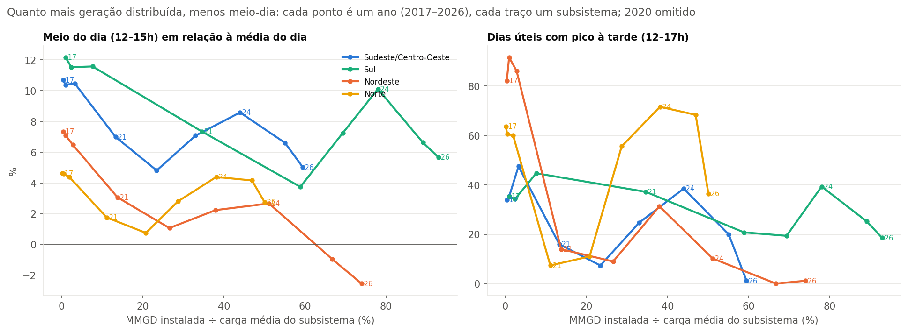

# Bloco 10 — Hipóteses que pedem dados externos

> Gerado por `src/eda/bloco10_hipoteses.py` sobre a extração de 11/09/2026. A agregação da ANEEL está em `data/reference/mmgd_por_subsistema.csv`; a interpretação ao final é do analista e está datada.

Os blocos 2–8 deixaram quatro hipóteses que os dados do ONS sozinhos não decidem. Este bloco testa a principal com dados abertos da ANEEL e registra o estado das outras.

## H1 — O vale solar do meio-dia acompanha a micro e minigeração distribuída

**Dado externo.** Cadastro de empreendimentos de geração distribuída da ANEEL (4,6 milhões de unidades em 13/09/2026), agregado por subsistema usando a composição por estado confirmada em [07-anomalias.md](../07-anomalias.md), com a potência acumulada até o fim de cada ano (data de atualização cadastral como proxy da conexão). 99% da potência é fotovoltaica.

| Subsistema | Ano | MMGD acumulada (GW) | Carga média (GW) | MMGD ÷ carga | Meio do dia | Noite | Pico à tarde |
|---|---|---|---|---|---|---|---|
| Sudeste/Centro-Oeste | 2017 | 0.1 | 36.1 | 0% | +10.7% | +12.1% | 34% |
| Sudeste/Centro-Oeste | 2018 | 0.4 | 36.5 | 1% | +10.4% | +11.9% | 35% |
| Sudeste/Centro-Oeste | 2019 | 1.2 | 37.1 | 3% | +10.5% | +11.0% | 47% |
| Sudeste/Centro-Oeste | 2021 | 5.2 | 39.2 | 13% | +7.0% | +12.4% | 16% |
| Sudeste/Centro-Oeste | 2022 | 9.3 | 39.7 | 23% | +4.8% | +13.9% | 7% |
| Sudeste/Centro-Oeste | 2023 | 13.8 | 41.9 | 33% | +7.1% | +11.6% | 25% |
| Sudeste/Centro-Oeste | 2024 | 19.6 | 44.5 | 44% | +8.6% | +9.9% | 38% |
| Sudeste/Centro-Oeste | 2025 | 24.4 | 44.2 | 55% | +6.6% | +12.1% | 20% |
| Sudeste/Centro-Oeste | 2026 | 26.2 | 44.1 | 59% | +5.0% | +13.6% | 1% |
| Sul | 2017 | 0.1 | 11.0 | 1% | +12.2% | +10.4% | 35% |
| Sul | 2018 | 0.3 | 11.1 | 2% | +11.5% | +10.5% | 34% |
| Sul | 2019 | 0.9 | 11.3 | 8% | +11.6% | +10.1% | 45% |
| Sul | 2021 | 4.1 | 12.0 | 35% | +7.3% | +12.2% | 37% |
| Sul | 2022 | 6.9 | 11.7 | 59% | +3.7% | +15.5% | 21% |
| Sul | 2023 | 8.7 | 12.6 | 69% | +7.2% | +12.6% | 19% |
| Sul | 2024 | 10.6 | 13.5 | 78% | +10.1% | +10.9% | 39% |
| Sul | 2025 | 12.3 | 13.8 | 89% | +6.6% | +14.4% | 25% |
| Sul | 2026 | 13.2 | 14.2 | 93% | +5.7% | +15.3% | 18% |
| Nordeste | 2017 | 0.0 | 10.2 | 0% | +7.3% | +4.5% | 82% |
| Nordeste | 2018 | 0.1 | 10.3 | 1% | +7.1% | +3.8% | 92% |
| Nordeste | 2019 | 0.3 | 10.6 | 3% | +6.5% | +3.6% | 86% |
| Nordeste | 2021 | 1.6 | 11.4 | 14% | +3.1% | +4.9% | 14% |
| Nordeste | 2022 | 3.0 | 11.2 | 27% | +1.1% | +7.8% | 9% |
| Nordeste | 2023 | 4.6 | 12.1 | 38% | +2.2% | +5.9% | 31% |
| Nordeste | 2024 | 6.7 | 13.1 | 51% | +2.7% | +5.7% | 10% |
| Nordeste | 2025 | 8.9 | 13.3 | 67% | -1.0% | +7.7% | 0% |
| Nordeste | 2026 | 9.9 | 13.4 | 74% | -2.5% | +9.3% | 1% |
| Norte | 2017 | 0.0 | 5.4 | 0% | +4.6% | +3.3% | 64% |
| Norte | 2018 | 0.0 | 5.3 | 0% | +4.6% | +3.5% | 60% |
| Norte | 2019 | 0.1 | 5.5 | 2% | +4.4% | +2.8% | 60% |
| Norte | 2021 | 0.7 | 6.0 | 11% | +1.8% | +2.7% | 7% |
| Norte | 2022 | 1.3 | 6.2 | 21% | +0.8% | +3.9% | 11% |
| Norte | 2023 | 2.0 | 7.1 | 29% | +2.8% | +2.4% | 56% |
| Norte | 2024 | 3.0 | 7.8 | 38% | +4.4% | +1.9% | 72% |
| Norte | 2025 | 3.9 | 8.3 | 47% | +4.2% | +2.1% | 68% |
| Norte | 2026 | 4.3 | 8.5 | 50% | +2.7% | +3.1% | 36% |

| Subsistema | Correlação MMGD÷carga × meio do dia (2017–2026) | Efeito por +10 p.p. de MMGD÷carga |
|---|---|---|
| Sudeste/Centro-Oeste | -0.71 | -0.7 p.p. |
| Sul | -0.73 | -0.6 p.p. |
| Nordeste | -0.92 | -1.1 p.p. |
| Norte | -0.17 | -0.1 p.p. |

## H2 — O que cresce no Norte

Sem dado externo conclusivo. O ONS projeta o Norte como o subsistema de maior crescimento percentual (cerca de +11% na revisão de 2026) e atribui a alta geral da carga a recuperação econômica, setores eletrointensivos (data centers, agronegócio, mineração) e migração para o mercado livre — sem detalhar o Norte. A interligação de Roraima ao SIN não aparece como degrau na série. Fica como hipótese aberta; a camada EPE (consumo por UF e classe) é o caminho natural para decidi-la, se o produto vier a precisar.

## H3 — Sazonalidade do Norte e do Nordeste é temperatura

Não testada: exigiria séries do INMET por estação meteorológica e um mapeamento para subsistemas. O padrão (Norte com máximo em setembro–outubro, na estação seca) é consistente com a hipótese, mas o projeto decidiu não incorporar base meteorológica na primeira versão (D08).

## H4 — Quanto de 2020 é COVID e quanto é clima

Não separável com os dados disponíveis; 2020 continua tratado como ano excepcional (D04).

## Leitura (analista, 14/09/2026)

**H1 se sustenta — com uma ressalva honesta.** A geração distribuída saiu de praticamente zero em 2017 para **26 GW no SE, 13 GW no Sul, 10 GW no NE e 4 GW no Norte** em agosto de 2026; em relação à carga média, o Sul chega a 93% e o Nordeste a 74%. E o meio do dia cai junto: correlação de **−0,92 no Nordeste**, −0,71 no SE, −0,73 no Sul. A cada 10 p.p. a mais de MMGD ÷ carga, o meio do dia perde 0,6 a 1,1 p.p. em relação à média do dia. A ressalva: as duas séries crescem no tempo, então parte da correlação é trivial. O que a torna convincente é a comparação *entre* subsistemas — o Nordeste, com o dia mais plano do país (amplitude 19%), é onde a mesma dose de MMGD move mais o formato, a ponto de virar o pico da tarde para a noite; e é onde a inclinação é a maior (−1,1 p.p.).

**O Norte é a exceção que informa.** Tem MMGD ÷ carga comparável ao SE (47% contra 55% em 2025), mas seu meio do dia quase não se moveu (+4,6% em 2017, +4,1% em 2025; correlação −0,17). Leitura: no Norte o meio do dia é sustentado por climatização na estação seca e por carga industrial contínua, que crescem junto com a MMGD e a compensam. Formato é o resultado de uma soma, não de um fator.

**O degrau de 2024 aparece nos quatro.** Em todos os subsistemas o ponto de 2024 fica acima da tendência — é o ano em que o ONS passou a *somar* a estimativa de MMGD à carga publicada — e em 2025 e 2026 a queda retoma. Ou seja, a estimativa oficial devolve parte do meio-dia, mas não toda: ou a estimativa é conservadora, ou há outros fatores diurnos (eficiência, mudança de hábitos, tarifa branca) além da MMGD. É a fronteira do que os dados públicos permitem dizer.

**O que leva para o produto.** O gráfico "MMGD × meio do dia" é o único do projeto que usa um dado fora do ONS, e é o que fecha a história da Camada 3: *o dia girou da tarde para a noite, e a geração distribuída é a explicação mais forte disponível*. Entra como visual de apoio, com a ressalva de correlação explícita no texto.
